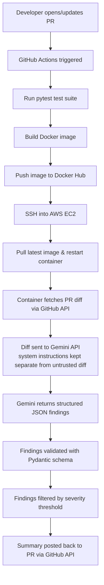

# AI Code Review Bot for CI/CD Pipelines

An AI-powered bot that automatically reviews pull requests inside a CI/CD pipeline and posts its findings as a structured PR comment — flagging security issues, bugs, and code smells with severity levels, file/line references, and suggested fixes.

## What It Does

When a pull request is opened or updated, this bot:
1. Fetches the PR's changed files and diff content via the GitHub API
2. Sends each file's diff to an AI model (Google Gemini) for review
3. Parses the AI's response into structured findings (severity, file, line, issue, explanation, suggested fix)
4. Posts a single formatted "AI Code Review Summary" comment back on the PR

The entire pipeline — test, build, push, and deploy — runs automatically through GitHub Actions, and the bot itself runs as a Docker container on a live AWS EC2 instance, not just inside the Actions runner.

## Architecture



## Features

- Triggers automatically on PR open and every new commit pushed to it
- Classifies each finding as CRITICAL, WARNING, or SUGGESTION
- Reports exact file and line number, an explanation, and a suggested fix for every issue
- Configurable via a `.aicr.yml` file (model choice, severity threshold, excluded paths, max diff size)
- Treats PR diff content as untrusted data — the AI's system instructions are kept structurally separate from the code being reviewed, to resist prompt injection from a malicious diff
- Runs as a real containerized service on cloud infrastructure, deployed automatically on every merge to the pipeline

## Tech Stack

- **Language:** Python 3.11
- **AI:** Google Gemini API (`google-genai` SDK), structured output validated with Pydantic
- **GitHub integration:** PyGithub (GitHub REST API)
- **CI/CD:** GitHub Actions
- **Containerization:** Docker, Docker Hub
- **Deployment:** AWS EC2 (Amazon Linux 2023)
- **Testing:** pytest
- **Config:** YAML (`.aicr.yml`)

## Project Structure
ai-code-review-bot/
├── app/
│ ├── main.py # Entry point: wires GitHub fetch -> review -> post comment
│ ├── github_client.py # GitHub API wrapper (PyGithub)
│ ├── ai_reviewer.py # Gemini API wrapper + Pydantic schemas
│ └── reviewer.py # Pure logic: filtering, severity, markdown formatting
├── tests/
│ └── test_reviewer.py # pytest suite (uses a fake AI reviewer, no real API calls)
├── demo/
│ └── sample_bad_code.py # Intentionally flawed file used to demo the bot
├── .github/workflows/
│ └── code-review.yml # Test -> build -> push -> deploy pipeline
├── .aicr.yml # Bot configuration
├── Dockerfile
├── .dockerignore
├── requirements.txt
├── .env.example # Placeholder env vars (real .env is gitignored)
└── .gitignore


## How It Works — Step by Step

1. A pull request is opened or updated against the repo.
2. The GitHub Actions workflow (`code-review.yml`) triggers, runs the pytest suite, then builds and pushes a Docker image to Docker Hub tagged with the run.
3. The workflow SSHes into an EC2 instance, pulls the new image, stops the previous container, and starts a fresh one with the required secrets passed in as environment variables.
4. Inside the container, `main.py` authenticates to GitHub, fetches the PR's changed files and their diffs, and filters out excluded paths / oversized diffs per `.aicr.yml`.
5. Each remaining file's diff is sent to Gemini with a system instruction that explicitly separates reviewing instructions from the diff content itself (the diff is never trusted as instructions).
6. Gemini's response is parsed and validated against a Pydantic schema (`Severity`, `Finding`, `ReviewResult`) so malformed AI output can't break the bot.
7. Findings are filtered against the configured severity threshold and formatted into markdown.
8. The bot posts one summary comment back on the PR listing every finding, its severity, its location, and a suggested fix.

## Configuration (`.aicr.yml`)

```yaml
model: gemini-3.8-flash
severity_threshold: SUGGESTION
excluded_paths:
  - "*.lock"
  - "package-lock.json"
  - "venv/*"
  - "node_modules/*"
max_diff_lines: 300
```

- `severity_threshold` controls the minimum severity that gets included in the posted comment.
- `excluded_paths` skips files that don't need AI review (lockfiles, dependency folders).
- `max_diff_lines` skips huge diffs to keep the review fast and inexpensive.

## Setup & Running Locally

```bash
git clone https://github.com/Tanishk-25/ai-code-review-bot.git
cd ai-code-review-bot
python3 -m venv venv
source venv/bin/activate
pip install -r requirements.txt
cp .env.example .env   # then fill in real values in .env — never commit this file
pytest                  # run the test suite
python -m app.main      # run the bot against the PR set in .env
```

## Security

- No secrets are hardcoded anywhere in the codebase. Locally they live in a gitignored `.env` file; in CI/CD they're stored as GitHub Actions Secrets and injected as environment variables at runtime.
- The GitHub Actions workflow requests only the minimum permissions it needs (`pull-requests: write`, `contents: read`).
- PR diff content is treated as untrusted input: the AI system prompt is structurally separated from the diff text, so a malicious PR can't smuggle instructions into the review model.
- `.env.example` ships with placeholder values only, so the repo never leaks real credentials.

## Screenshots

_(Add these after capturing them — see the checklist below)_

- Pull request with the AI Code Review Summary comment
- GitHub Actions workflow run, all steps green
- Docker Hub repository with pushed image
- EC2 instance running the container

## Limitations & Future Improvements

- The bot re-reviews the full diff on every push rather than only newly changed lines since the last review.
- Deployment relies on SSH key auth into a single EC2 instance with no auto-scaling or high availability — fine for a demo, not production-grade.
- The EC2 security group currently allows inbound SSH from any IP; the real security boundary is the SSH key, but a production setup would restrict this further (a bastion host, GitHub's published Actions IP ranges, or AWS Systems Manager Session Manager instead of open SSH).
- No persistent history of past reviews — each run is stateless.
- Currently supports a single AI provider (Gemini); swapping providers would mean updating `ai_reviewer.py`.

## License

MIT
